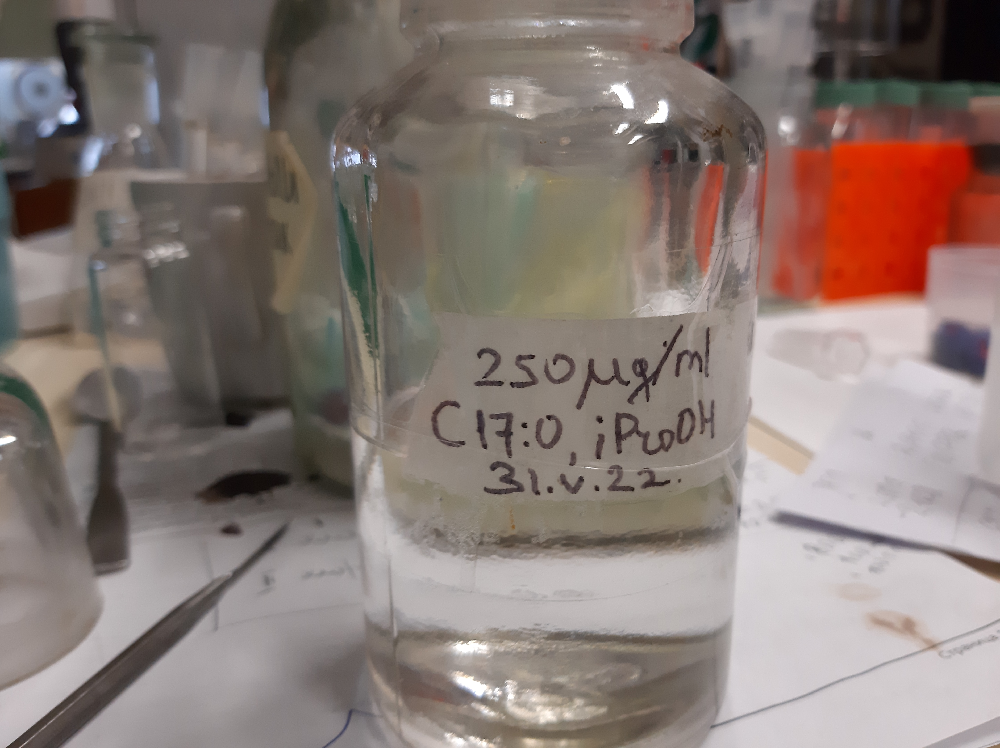
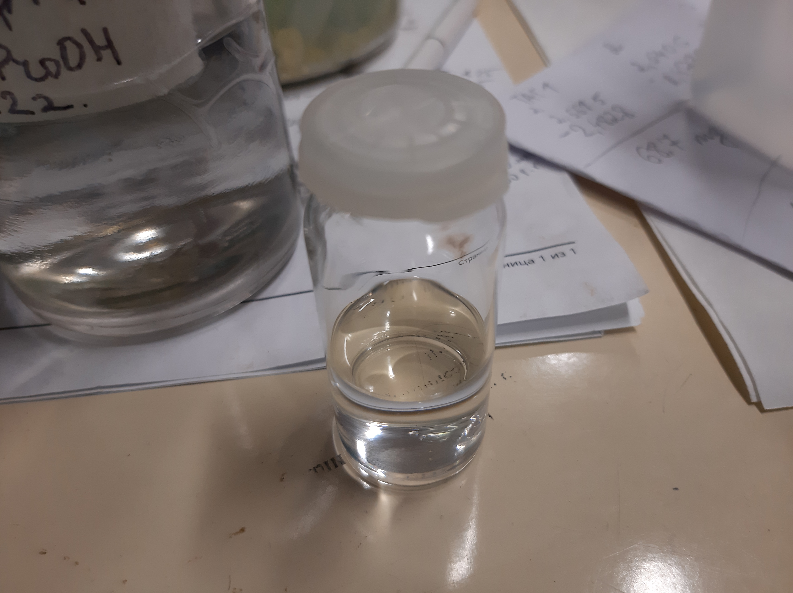
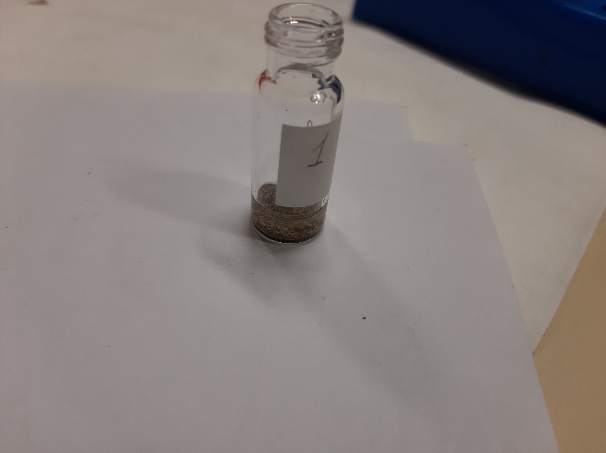
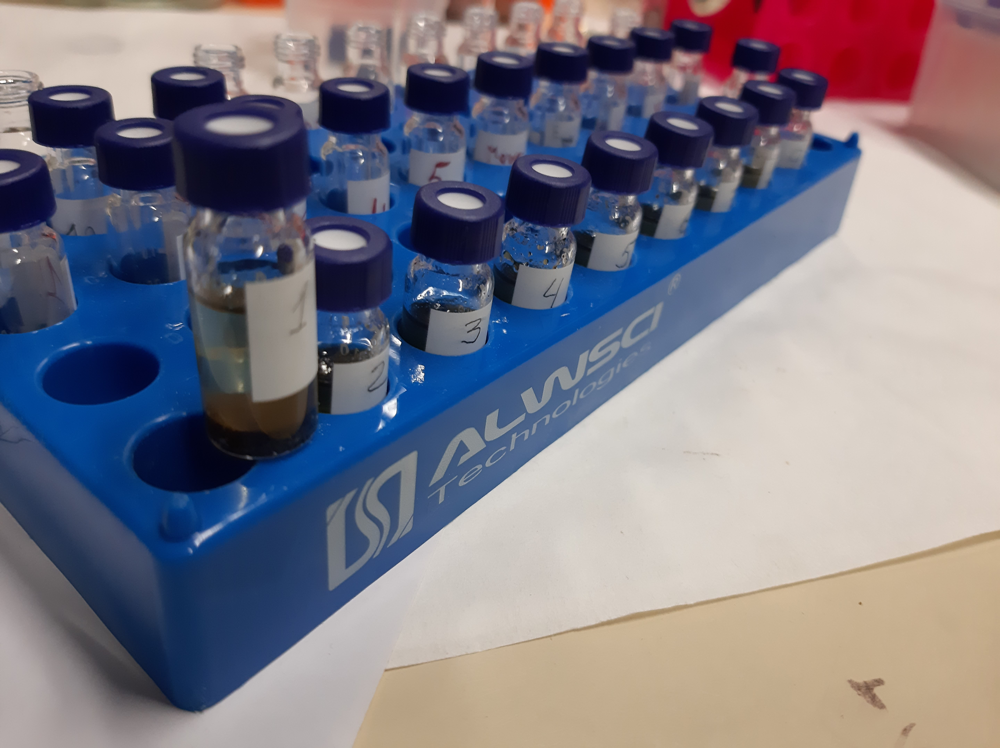

# Опредеоение количественного и качественного состава $TL$ нативной ткани семян *Lunaria rediviva*
:figure-caption: Изображение
:figures-caption: Изображения
:nofooter:
:table-caption: Таблица
:table-details: Детали таблицы

Исходная масса семян: 6.4640 $g$

== Пробы 1, 2, 3

.Масса семян
[cols="4*", frame=all, grid=all]
|===
|ID|$m_0, g$|$m_1, g$|$m_2, g$
|1|13.7540|15.9055|2.1515
|2|13.7926|16.0092|2.2166
|3|13.8255|15.8340|2.0085
|===
.{table-details}
[%collapsible]
====
$m_0$:: Масса пустой пробирки
$m_1$:: Масса пробирки с пробой
$m_2$:: Масса пробы
====

. Внести $CHCl_3$: 15 $\mu L$
. Внести $CHCl_3$: 5 $\mu L$
. Внести $H_2O$: 5 $\mu L$
. Внести $H_2O$: 5 $\mu L$
. Внести $Benzene$: 5 $\mu L$

== Пробы $TL_1$, $TL_2$, $TL_3$

.Масса $TL$
[cols="4*", frame=all, grid=all]
|===
|ID|$m_0, g$|$m_1, g$|$m_2, g$
|$TL_1$|19.5393|19.9353|0.3960
|$TL_2$|13.6419|14.0346|0.3927
|$TL_3$|13.4307|13.7643|0.3336
|===
.{table-details}
[%collapsible]
====
$m_0$:: Масса пустой пробирки
$m_1$:: Масса пробирки с пробой
$m_2$:: Масса пробы
====

. Внести $CHCl_3$: 5 $mL$

.{figures-caption}
[%collapsible]
====
[cols="2*", frame=none, grid=none]
|===
|image:images/20240123_131158.jpg[]
|
|
|image:images/20240123_134849.jpg[]
|
|
|image:images/20240123_140502.jpg[]
|image:images/20240123_140508.jpg[]
|===
====
