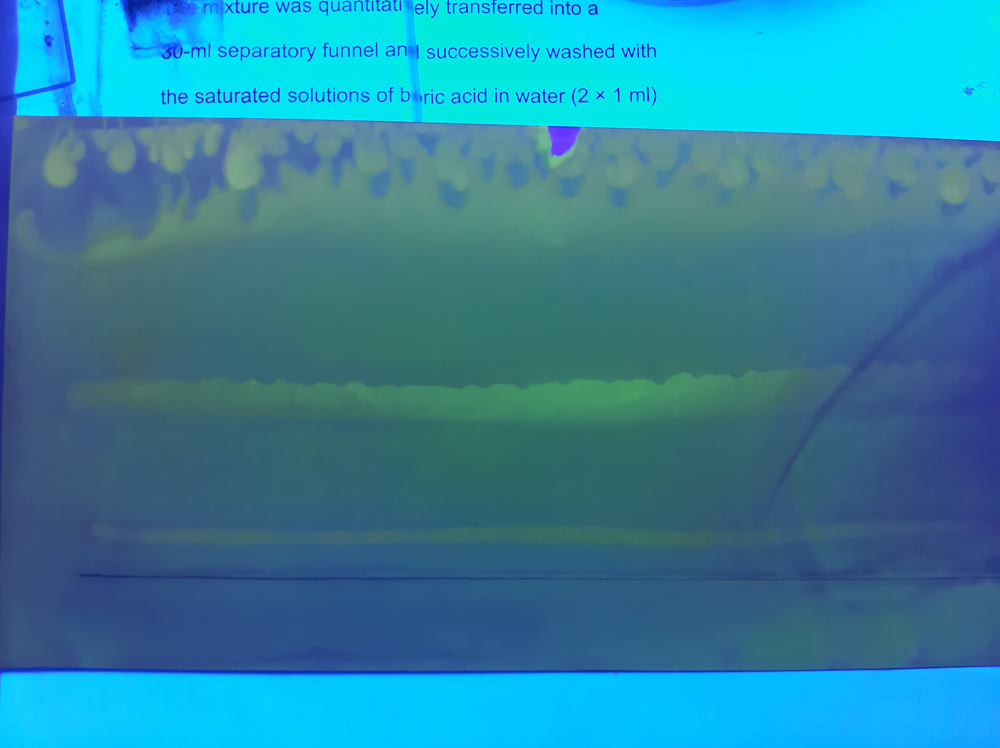
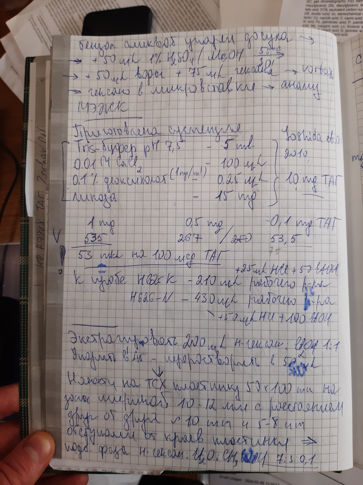

= Определение нативных диглицеридов *Lunaria rediviva*
== Выделение стандарта диглицеридов *Lunaria rediviva*
:figure-caption: Изображение
:figures-caption: Изображения
:nofooter:
:table-caption: Таблица
:table-details: Детали таблицы

:suspension: footnote:disclaimer[Opinions are my own.]

== Пробы

.{figures-caption}
[%collapsible]
====
[cols="2*", frame=none, grid=none]
|===
|
|
|===
====

.Масса пробы
[cols="4*", frame=all, grid=all]
|===
|ID|$m_0, g$|$m_1, g$|$m_2, g$
|1|1.0073|1.0096|0.0023
|2|1.0023|1.0045|0.0022
|===
.{table-details}
[%collapsible]
====
$m_0$:: Масса пустой пробирки
$m_1$:: Масса пробирки с пробой
$m_2$:: Масса пробы
====

. Взять 10 пробирок
. Внести $TAG$: 50 $\mu L$
. Внести *суспензию* footnote:suspension[
    Объем *суспензии* для 10 $mg$ $TAG$:pass:c,a,r,m,n,v,p[ +]
    pass:c,a,r,m,n,v,p[* *Tris-buffer 7.5*: 5 $mL$]
    ]: 1200 $\mu L$

. Греть 40 $min$, 60 ${\degree}C$
. Объединить все пробы в одну пробу $DAG_N$
. Промыть пробирки $[Hexane/Et_2O; 1/1, v/v]$ и добавить в пробу $DAG_N$

== Проба $DAG_N$

. Центрифугировать 3 $min$, 2300 $g$
. Отобрать верхнюю фазу
. Упарить досуха в токе $Ar$
. TLC
Неподвижная фаза:: $Silica\ gel\ 60$
Подвижная фаза:: $[Hexane/Et_2O; 1/1, v/v]$: 15 $mL$
