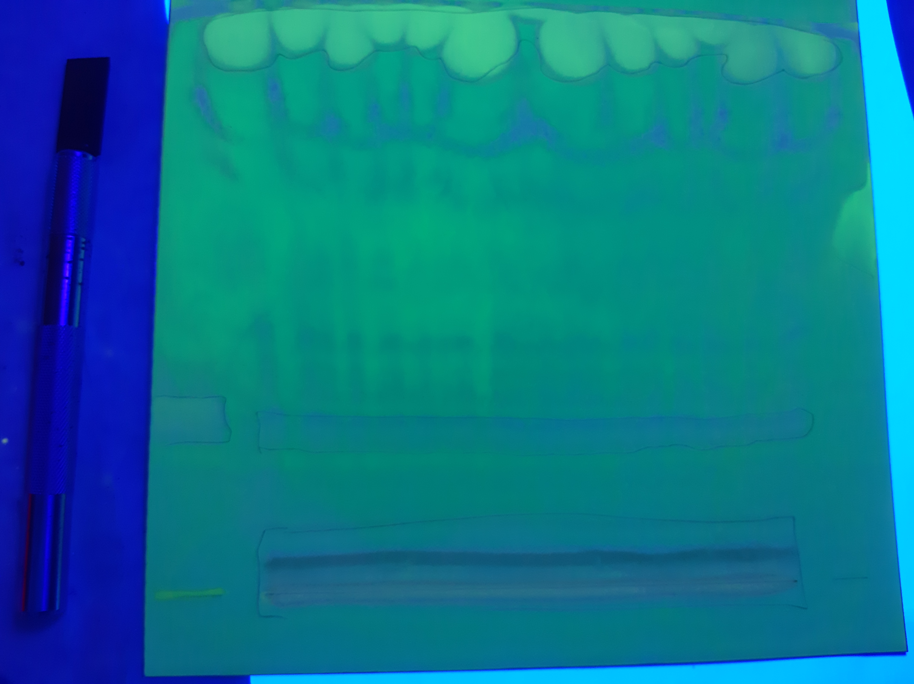

= Определение нативных диглицеридов *Lunaria rediviva*
:figures-caption: Изображения
:nofooter:
:table-caption: Таблица
:table-details: Детали таблицы

== Проба xref:../2024-01-23/1.adoc#пробы-tl_1-tl_2-tl_3[🔗] $TL_1$, $TL_2$, $TL_3$

. Внести пробу: 700 $\mu L$
. Упарить досуха в токе $Ar$
+
--
.Массы проб
[cols="4*", frame=all, grid=all]
|===
|ID|$m_0, g$|$m_1, g$|$m_2, g$
|1|1.0965|1.1504|0.0539
|2|1.0922|1.1469|0.0547
|3|1.0933|1.1450|0.0517
|===
.{table-details}
[%collapsible]
====
$m_0$:: Масса пустой пробирки
$m_1$:: Масса пробирки с пробой
$m_2$:: Масса пробы
====
--
. Внести $[CHCl_3/MeOH; 2/1, v/v]$: 300 $\mu L$
. TLC
Неподвижная фаза:: $Silica\ gel\ 60$
Подвижная фаза:: $[Hexane/Et_2O; 1/1, v/v]$: 20 $mL$
Проба:: каждая отдельно
. Опрыскать $DCF$
+
.{figures-caption}
[%collapsible]
====
[cols="2*", frame=none, grid=none]
|===
|
|image:images/20240305_145714.jpg[]
|===
====
. Отобрать пробы $PL$ и $DAG$

== Проба $PL$

. Внести $[CHCl_3/MeOH; 2/1, v/v]$: 10 $mL$

== Проба $DAG$

. Внести $[Hexane/Et_2O; 1/1, v/v]$: 1 $mL$
