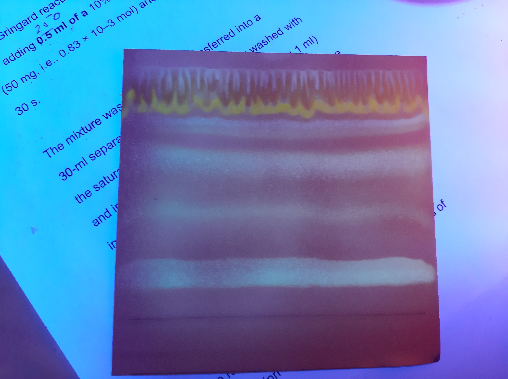
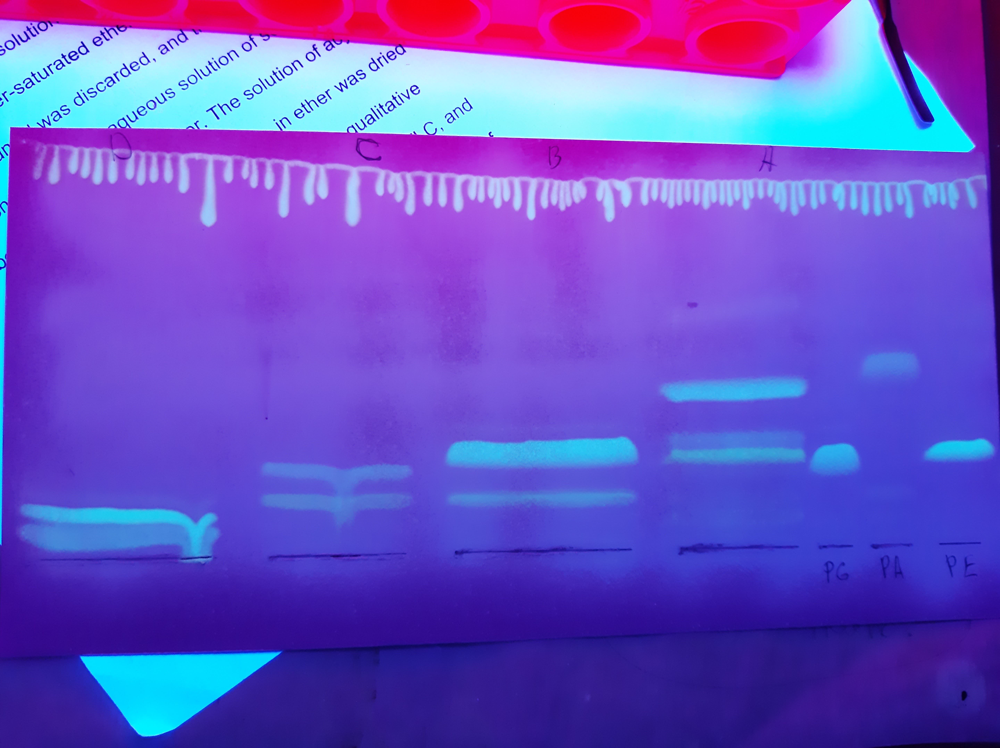

= Анализ $PL$ *Lunaria rediviva* методом двумерного TLC на двух различных пластинках
:figure-caption: Изображение
:figures-caption: Изображения
:nofooter:
:table-caption: Таблица
:table-details: Детали таблицы

. TLC (первое измерение)
Неподвижная фаза:: $Silica\ gel\ 60$
Подвижная фаза:: $[CHCl_3/MeOH/H_2O; 30/10/1, v/v/v]$: 41 $mL$
. Опрыскать $Primuline$
. Получить 4 пробы: A, B, C, D
. Для каждой пробы:
.. Внести $[CHCl_3/MeOH; 2/1, v/v]$: 1 $mL$
.. Центрифугировать 3 $min$, 2300 $g$
.. Два раза:
... Внести $[CHCl_3/MeOH; 2/1, v/v]$: 500 $\mu L$
... Центрифугировать 3 $min$, 2300 $g$
.. Внести $H_2O$: 400 $\mu L$
.. Центрифугировать 3 $min$, 2300 $g$
.. Отобрать нижнюю фазу
.. Упарить досуха
.. Перерастворить в $[CHCl_3/MeOH; 2/1, v/v]$: 70 $\mu L$

.Относительные коэффициенты удерживания
[cols="5*", frame=all, grid=all]
|===
|ID|Lower|Middle|Upper|RF
|FL|-|1512|-|1.00
|A|1047|1109|1171|0.73
|B|791|886.5|982|0.59
|C|532|598|664|0.40
|D|146|237|328|0.16
|===
.{table-details}
[%collapsible]
====
A, B, C, D:: Идентификатор пробы
FL:: Линия фронта
Lower:: Нижняя граница
Middle:: Среднее арифметическое нижней и верхней границ
Upper:: Верхняя граница
RF (Retention Factors):: Относительный коэффициент удерживания
====

.{figures-caption}
[%collapsible]
====
.Первое измерение

====

. TLC (второе измерение)
Неподвижная фаза:: $Silica\ gel\ 60$
Подвижная фаза:: $[CHCl_3/MeOH/Acetic\ acid/H_2O; 80/9/12/2, v/v/v/v]$: 51,5 $mL$
. Опрыскать $Primuline$
. Получить 10 проб

.{figures-caption}
[%collapsible]
====
.Второе измерение

====
