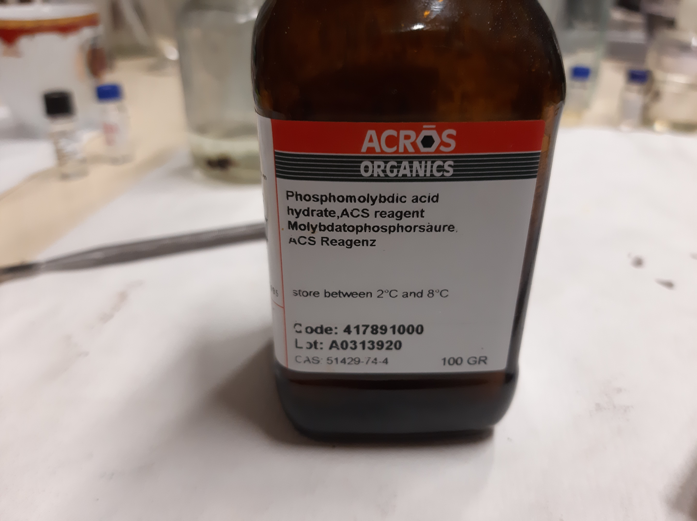
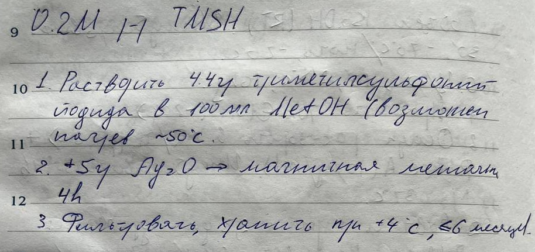

= Abbreviations
:figure-caption: Изображение
:figures-caption: Изображения
:nofooter:

== $DCF$

🇬🇧:: Dichlorofluorescein
🇷🇺:: Дихлорфлуоресцеин

== $PC$

🇬🇧:: Phosphatidylcholines
🇷🇺:: Фосфатидилхолины

== $PE$

🇬🇧:: Phosphatidylethanolamine
🇷🇺:: Фосфатидилэтаноламин

== $PMA$

🇬🇧:: Phosphomolybdic acid
🇷🇺:: Фосфомолибденовая кислота

.{figures-caption}
[%collapsible]
====

====

== $TL$

🇬🇧:: Total lipids
🇷🇺:: Суммарные липиды

== $TMSH$

🇬🇧:: Trimethylsulfonium hydroxide
🇷🇺:: Триметилсульфоний гидроксид

.{figures-caption}
[%collapsible]
====

====
